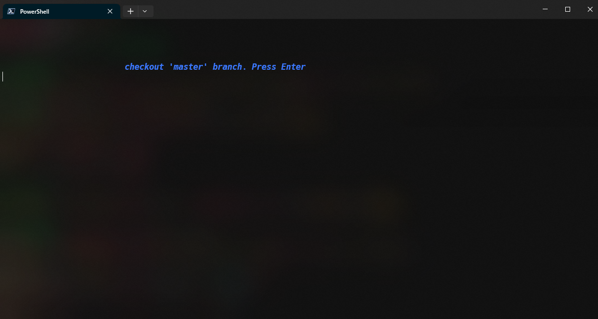

### Now Developing...
Current development progress


only debugging in Windows Terminal with PowerShell.
# Run
```
git clone https://github.com/root309/TerminalBranchNavigator.git
```
```
cd TerminalBranchNavigator
```
```
cargo build
```

Please write the contents of the user_profile.ps1 file as described in `user_profile example`. By doing so, you will be able to execute the compiled exe file as a command in PowerShell.
### `user_profile.ps1 example`
```
Set-Alias gb 'C:\path\RepositoryDirectory\target\debug\TerminalBranchNavigator.exe'
```
Please execute the following command at the root of the repository.
```
gb
```